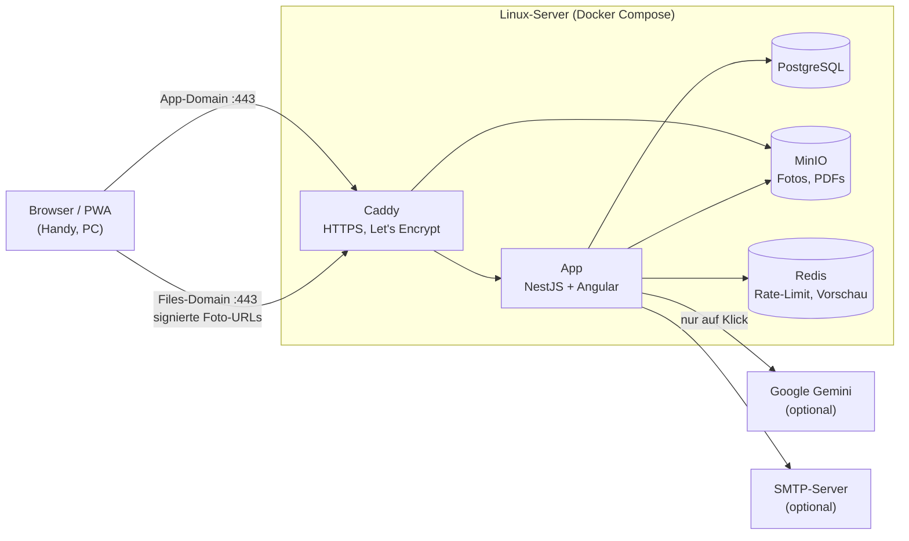

# RE-SEARCH: Technisches Datenblatt

Stand: September 2026 (Version `main`, nach Issues #102 bis #107)

Kapitel 1 und die Checkliste in Kapitel 5.3 richten sich an die
Geschäftsführung, die übrigen Kapitel an die IT des Kunden.

## 1. Überblick

RE-SEARCH dokumentiert Wareneingänge von Abfällen: Mitarbeiter erfassen am
Handy oder PC einen Wareneintrag mit bis zu drei Fotos, optional einem PDF
(z. B. Lieferschein), dem AVV-Abfallschlüssel und einem Freitext. Alle
Einträge sind für angemeldete Nutzer durchsuchbar und nach AVV-Code und
Standort filterbar. Optional schätzt eine KI-Analyse aus den Fotos die
Zusammensetzung des Abfalls und prüft, ob der AVV-Code passt.

Die Anwendung läuft komplett auf einem einzigen Linux-Server in Docker. Nur
der Reverse Proxy ist aus dem Internet erreichbar, Datenbank, Fotospeicher
und Cache bleiben intern.

## 2. Eingesetzte Technik

| Komponente | Version | Wozu |
|---|---|---|
| Angular | 22.1 | Oberfläche als Progressive Web App, installierbar auf Handy und PC, keine App-Stores ([ADR-0002](adr/0002-pwa-statt-native-app.md)) |
| Angular Material | 22.1 | Bedienelemente, helles und dunkles Farbschema, barrierearm (WCAG 2.2 AA geprüft) |
| Angular Service Worker | 22.1 | Speichert die Programmdateien im Browser, schnellerer Start; keine Nutzdaten im Cache |
| Node.js | 22.23 | Laufzeit für das Backend |
| NestJS | 12.0 | Backend: REST-API unter `/api/v1`, liefert auch die Oberfläche aus (eine Domain, kein CORS) |
| Prisma ORM | 7.10 | Datenbankzugriff und versionierte Migrationen ([ADR-0005](adr/0005-prisma-als-orm-migrationstool.md)) |
| PostgreSQL | 16 | Datenbank für Nutzer, Standorte, AVV-Codes, Wareneinträge, KI-Analysen; Volltextsuche auf Deutsch ([ADR-0001](adr/0001-postgresql-statt-mongodb.md)) |
| MinIO | Chainguard-Build, per Digest fixiert | S3-kompatibler Objektspeicher für Fotos und PDFs ([ADR-0003](adr/0003-s3-kompatible-objektspeicher-abstraktion.md)); austauschbar gegen jeden S3-Dienst |
| Redis | 8.8 | Gemeinsame Zähler für Rate-Limits, KI-Vorschau für eine Stunde |
| Caddy | 2.10 | Reverse Proxy, holt und erneuert TLS-Zertifikate automatisch bei Let's Encrypt |
| Docker Compose | aktuelle Docker Engine | Betrieb aller Dienste mit einer Datei (`docker-compose.prod.yml`) |
| Google Gemini API | Modell `gemini-3.8-flash`, per Variable wählbar | KI-Analyse der Fotos, **optional**, ohne API-Key abgeschaltet ([ADR-0008](adr/0008-ki-analyse-ueber-gemini.md)) |
| SMTP (nodemailer 10) | beliebiger Anbieter | Einladungs- und Passwort-Mails, **optional**, ohne Zugang werden Mails nur protokolliert ([ADR-0006](adr/0006-admin-flag-und-mailversand.md)) |
| Tages-Logs | eigene Umsetzung | Aktivitäts- und Fehlerprotokoll je Tag, für Admins in der App einsehbar, 30 Tage Aufbewahrung ([ADR-0007](adr/0007-tages-logs-aktivitaet-und-fehler.md)) |
| Stammdaten AVV | Abfallverzeichnis-Verordnung, 834 Abfallschlüssel | Auswahlliste beim Erfassen, wird bei der Installation eingespielt |
| Qualitätssicherung | Vitest 4, Playwright 1.63, axe-core, oxlint, ESLint 10, Prettier 3 | Unit-, Integrations- und End-to-End-Tests, automatische Barrierefreiheitsprüfung; läuft bei jeder Änderung in der CI (GitHub Actions) |

## 3. Sicherheit

- **Anmeldung:** E-Mail und Passwort, Passwörter nur als bcrypt-Hash. Die
  Sitzung steckt in einem HttpOnly-Cookie (JWT, 8 Stunden gültig), für das
  JavaScript nicht erreichbar. Schreibende Anfragen brauchen zusätzlich ein
  CSRF-Token.
- **Konten:** nur auf Einladung durch einen Admin. Einladungslinks gelten
  7 Tage, Passwort-Links 24 Stunden bzw. 1 Stunde (Passwort vergessen).
- **Berechtigungen:** Nur Admins verwalten Nutzer und sehen die Logs. Einen
  Wareneintrag ändern oder löschen darf nur, wer ihn erfasst hat; das prüft
  der Server, nicht nur die Oberfläche.
- **Rate-Limits:** 60 Anfragen pro Minute und IP, Anmeldung und
  Passwort-Funktionen 5 pro Minute, KI-Analyse 5 pro Minute und Nutzer. Die
  Zähler liegen in Redis und gelten damit auch bei mehreren App-Instanzen.
- **Uploads:** Der Server prüft den echten Dateityp anhand der ersten Bytes
  (Magic Bytes), nicht anhand der Angabe des Browsers. Erlaubt sind JPEG, PNG
  und WebP für Fotos und PDF für Dokumente; SVG und alles andere wird
  abgelehnt. Größe pro Datei begrenzt (siehe 5.1).
- **Security-Header:** Content-Security-Policy ohne fremde Quellen,
  HSTS, `no-referrer`, Schutz vor Einbetten in fremde Seiten (Helmet).
- **Getrennte Files-Domain:** Fotos und PDFs liegen nicht öffentlich. Der
  Browser bekommt pro Datei eine signierte URL, die 15 Minuten gilt, und lädt
  sie über eine eigene Subdomain.
- **Netzwerk:** Nur Caddy veröffentlicht Ports (80 für die
  Zertifikatsausstellung und Weiterleitung, 443). Datenbank, MinIO und Redis
  haben keine offenen Ports. Die App-Rechte auf den Objektspeicher sind auf
  den einen Bucket beschränkt.
- **Externe Inhalte:** keine. Schriften und Icons sind in der Anwendung
  gebündelt, es gibt kein Tracking und kein CDN.

## 4. Betrieb

- **Backups:** Ein Skript sichert täglich die Datenbank (`pg_dump`), das
  MinIO-Volume und die `.env`. Auf dem Testserver: 7 Tage auf dem Server plus
  tägliche Kopie auf einen externen Rechner (30 Tage). Die Wiederherstellung
  in eine leere Datenbank ist getestet. Die Tages-Logs sind nicht Teil der
  Sicherung.
- **Updates:** Ein Deploy-Skript sichert zuerst, holt den neuen Stand, baut
  die Container neu, spielt Datenbank-Migrationen ein und prüft danach, ob
  die Anwendung mit HTTP 200 antwortet. Dauer wenige Minuten, kurze
  Unterbrechung beim Neustart der App.
- **Betriebssystem:** automatische Sicherheitsupdates (unattended-upgrades),
  Firewall (ufw), fail2ban für SSH, Anmeldung nur per SSH-Schlüssel.
- **Logs:** App-Tages-Logs im Docker-Volume, 30 Tage, in der App unter
  „Logs“ lesbar und herunterladbar. Docker-Logs sind in der Größe begrenzt.
- **Monitoring:** Healthcheck nach jedem Deploy, Docker startet abgestürzte
  Container selbst neu. Ein externes Uptime-Monitoring mit Alarm gibt es noch
  nicht; für den Echtbetrieb empfohlen (z. B. über die Kunden-IT oder einen
  Uptime-Dienst).

## 5. Migration in den Echtbetrieb

Der Echtbetrieb startet **leer**: nur die AVV-Stammdaten, die Standorte des
Kunden und der erste Admin. Daten und Fotos des Testservers werden nicht
übernommen.

### 5.1 Mindestanforderung Server

- Linux x86_64 (z. B. Debian oder Ubuntu) mit Docker Engine und Docker
  Compose
- Richtwert **2 vCPU, 4 GB RAM**, SSD
- Ports 80 und 443 aus dem Internet erreichbar, feste öffentliche IPv4
- Ausgehend: HTTPS (Let's Encrypt, optional Google Gemini) und der
  SMTP-Port des Mail-Anbieters

**Upload-Grenze wächst mit dem RAM.** Hochgeladene Dateien liegen während der
Prüfung komplett im Arbeitsspeicher. Deshalb werden die maximale Dateigröße
(`UPLOAD_MAX_MB`) und das Speicherlimit der App (`APP_MEM_LIMIT`) zusammen am
Server-RAM ausgerichtet. Richtwerte für 5 gleichzeitige Uploads à 4 Dateien,
mit ca. 1 GB Reserve für Datenbank, MinIO und System:

| Server-RAM | `APP_MEM_LIMIT` | `UPLOAD_MAX_MB` (pro Datei) |
|---|---|---|
| 4 GB | 1,5 GB | 50 |
| 8 GB | 5 GB | 150 |
| 16 GB | 12 GB | 400 |

Die App verkleinert neue Fotos schon im Browser auf 2000 Pixel, typische
Fotos landen damit bei unter 1 MB. Das Limit betrifft vor allem große PDFs.

**Speicherplatz, Rechenbeispiel:** 500 Einträge pro Monat × (3 Fotos à ca.
0,5 MB + 1 PDF à ca. 0,5 MB) ≈ 1 GB pro Monat, also ca. 12 GB pro Jahr.
Werden die Sicherungen auf demselben Server aufbewahrt (7 Tage als volle
Kopie), braucht es zusätzlich ein Vielfaches davon; besser ist ein externes
Backup-Ziel (siehe Checkliste). Richtwert: 80 GB SSD reichen bei diesem
Volumen für mehrere Jahre, wenn Backups extern liegen.

### 5.2 Betriebsmodell

| | A: Kunde betreibt | B: Betrieb durch uns |
|---|---|---|
| Server | eigener Server oder Cloud des Kunden | Hoster in Deutschland, Vertrag auf den Kunden |
| Installation | durch uns, per SSH oder mit der Kunden-IT | durch uns |
| Updates, Backups, Überwachung | Kunden-IT, Skripte und Anleitung von uns | durch uns |
| Auftragsverarbeitung | nur Hoster ↔ Kunde | zusätzlich AV-Vertrag Kunde ↔ uns |

**Objektspeicher:** Standard ist MinIO auf demselben Server. Hat der Kunde
einen eigenen S3-kompatiblen Speicher (z. B. bei seinem Hoster oder in der
eigenen Cloud, idealerweise mit Rechenzentrum in der EU), stellt die App nur
per Konfiguration um. MinIO entfällt dann, Fotos werden im S3-Dienst
gesichert statt im Server-Backup.

### 5.3 Vom Kunden zu liefern

Diese Liste kann direkt an Sie als Kunden gehen. Bitte liefern Sie uns vor
der Installation:

- [ ] **Betriebsmodell:** A (Sie betreiben den Server) oder B (wir
  betreiben ihn auf Ihre Rechnung), siehe 5.2
- [ ] **Server** nach 5.1, oder bei Modell B Ihre Zustimmung zur Bestellung
  beim Hoster
- [ ] **Zwei Domains oder Subdomains**, z. B. `research.ihre-firma.de` für
  die Anwendung und `fotos-research.ihre-firma.de` für Fotos. Beide
  brauchen einen DNS-A-Record auf die IP des Servers, **vor** der
  Installation.
- [ ] **E-Mail-Versand:** SMTP-Server, Port, Benutzername, Passwort und die
  Absenderadresse (z. B. `research@ihre-firma.de`). Ohne Mail-Zugang
  funktionieren Einladungen und „Passwort vergessen“ nicht automatisch.
- [ ] **KI-Analyse:** Entscheidung, ob Sie sie nutzen möchten. Wenn ja: ein
  Google-Konto mit **bezahltem** Gemini-Tarif (oder Google Vertex AI mit
  Region in der EU), einen API-Key daraus und den abgeschlossenen
  Auftragsverarbeitungsvertrag mit Google. Wenn nein, bleibt die Funktion
  ausgeschaltet, alles andere funktioniert unverändert.
- [ ] **Erster Admin:** Name, E-Mail-Adresse und Standort
- [ ] **Standorte:** vollständige Liste der Standortnamen (Standorte werden
  bei der Installation angelegt, nachträgliche Änderungen gehen über uns)
- [ ] **Nutzer:** Liste mit Vorname, Nachname, E-Mail, Standort und ob die
  Person Admin sein soll. Die Nutzer bekommen eine Einladung per Mail und
  setzen ihr Passwort selbst.
- [ ] **Impressum und Datenschutzerklärung** für Ihren Betrieb (siehe 5.6)
- [ ] **Backup-Ziel:** externer Speicher, z. B. S3-Bucket oder SFTP bei
  Ihrem Hoster, mit Zugangsdaten. Optional: eigener S3-Speicher für die
  Fotos statt MinIO (siehe 5.2).
- [ ] **Zugang für die Installation:** SSH-Zugang zum Server oder eine
  benannte Ansprechperson Ihrer IT mit Termin

### 5.4 Von uns erzeugt

- Alle Geheimnisse als lange Zufallswerte: `JWT_SECRET`, `POSTGRES_PASSWORD`,
  `MINIO_ROOT_PASSWORD`, `MINIO_APP_SECRET`, Start-Passwort des ersten Admins
- `.env` auf Basis von `.env.prod.example`, inklusive `UPLOAD_MAX_MB` und
  `APP_MEM_LIMIT` passend zum Server-RAM
- Standortliste im Seed statt des Platzhalters „Hauptsitz“
- Backup- und Deploy-Skript, Zeitplan für die tägliche Sicherung

Geheimnisse werden nicht per E-Mail verschickt und liegen nur in der `.env`
auf dem Server und in der verschlüsselten Sicherung.

### 5.5 Ablauf Erstinstallation

1. **Server prüfen:** Betriebssystem, Docker, Firewall (nur 22, 80, 443),
   Zeitzone, freier Speicher; DNS beider Domains zeigt auf den Server.
2. **Code bereitstellen:** Repository auf den Server, Images bauen.
3. **`.env` anlegen** (5.4), Standortliste eintragen.
4. **Starten:** `docker compose -f docker-compose.prod.yml up -d`. Dabei
   laufen automatisch die Datenbank-Migrationen und der Seed (AVV-Codes,
   Standorte, erster Admin); Caddy holt die Zertifikate.
5. **Smoke-Test:** Anmeldung, Wareneintrag mit Foto und PDF anlegen,
   Foto anzeigen, suchen, bearbeiten, löschen; Testmail verschicken; bei
   aktivierter KI eine Analyse.
6. **Admin-Einladung:** Erster Admin setzt sein Passwort, lädt die übrigen
   Nutzer ein.
7. **Backup-Test:** Sicherung auslösen, in eine leere Datenbank
   zurückspielen und vergleichen; Zeitplan aktivieren.
8. **Übergabe:** Zugänge, Kurzanleitung, Ansprechpartner; bei Modell A
   Einweisung der Kunden-IT in Updates und Backups.

### 5.6 Rechtliches

- **Verantwortlicher im Echtbetrieb ist der Kunde.** Das Impressum und die
  Datenschutzerklärung der Demo unter research.patrickfrantzen.de gelten
  nur für den Testbetrieb. Der Kunde stellt eine eigene, juristisch geprüfte
  Datenschutzerklärung; die Demo-Fassung (`/datenschutz`) listet alle
  Verarbeitungen und kann als Vorlage dienen. Für Beschäftigtendaten gilt
  § 26 BDSG.
- **Auftragsverarbeitung (Art. 28 DSGVO):** mit dem Hoster; bei Modell B
  zusätzlich zwischen Kunde und uns; bei Nutzung der KI-Analyse mit Google.
- **KI-Analyse:** Die Fotos verlassen dabei den Server und gehen an Google
  in die USA (Drittlandübermittlung). Im Echtbetrieb nur mit bezahltem Tarif
  oder Vertex AI mit EU-Region und AV-Vertrag; der kostenlose Tarif der Demo
  erlaubt Google, die Eingaben zu nutzen, und ist für Kundendaten nicht
  geeignet. Die Analyse läuft nur auf ausdrücklichen Klick nach einem
  Hinweis und lässt sich komplett abschalten.
- **Fotos:** Mitarbeiter sollen nur den Abfall fotografieren; Personen oder
  Kfz-Kennzeichen können sonst zufällig erfasst werden. Eine interne
  Anweisung dazu wird empfohlen.
